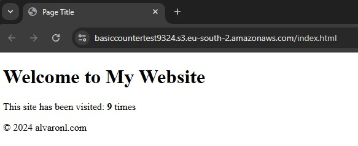

# Lambda function + Api Gateway into DynamoDB

Deploy a DynamoDB to store a visit counter. Create a Lambda function with boto3 lib that updates and queries the current visit. Then use the API Gateway to access the Lambda function.

## Steps

The steps to take are:

    1. Deploy DynamoDB
    2. Create the Lambda function
    3. Create and configure the API Gateway.
    4. Retry with Terraform.

## Modules

#### api_gateway

#### dynamodb

To store the visit counter

#### Lambda

To update and retrieve the counter

#### storage-create

It is requiered to create the bucket empty to parse its url into the files lambda cors origin. You could bypass this requirement by "guessing" the name you are already going to use in the storage-create module. But I wanted to force myself to test the templates in terraform

#### storage-upload

Upload the files after every resource and files are created. If we do it before, or at the same time as the module storage-create, there will be no api.js. Or it's url within to reference the API Gateway, will be empty. 

Result: 

